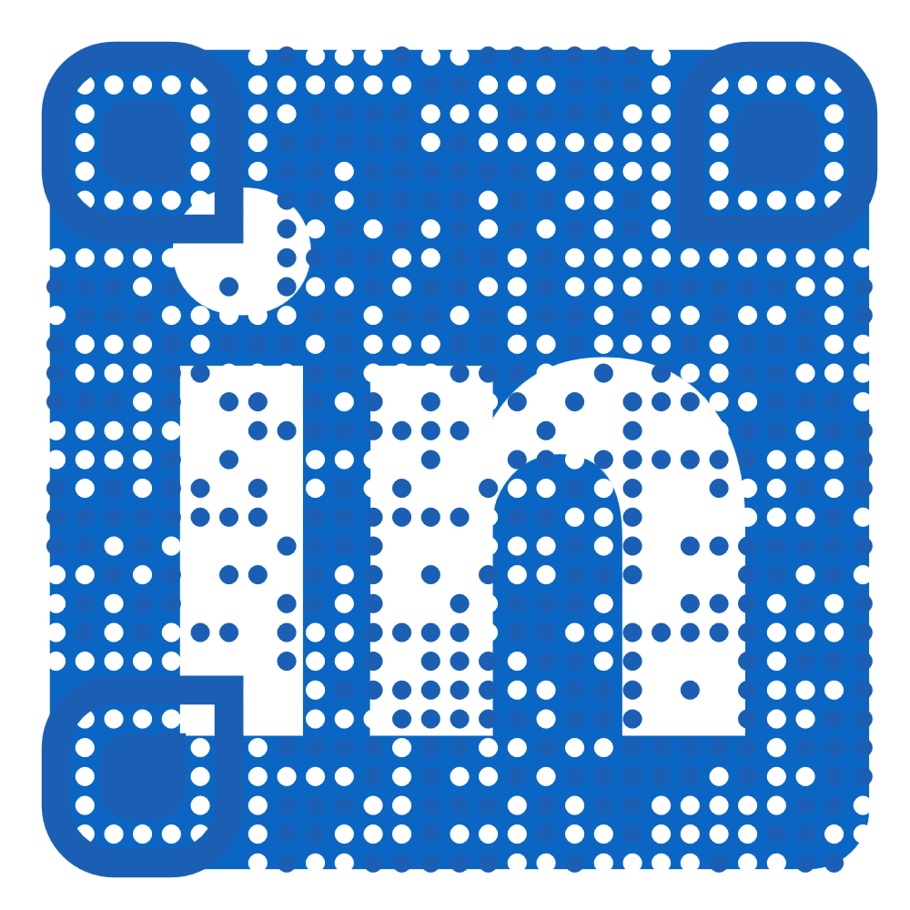
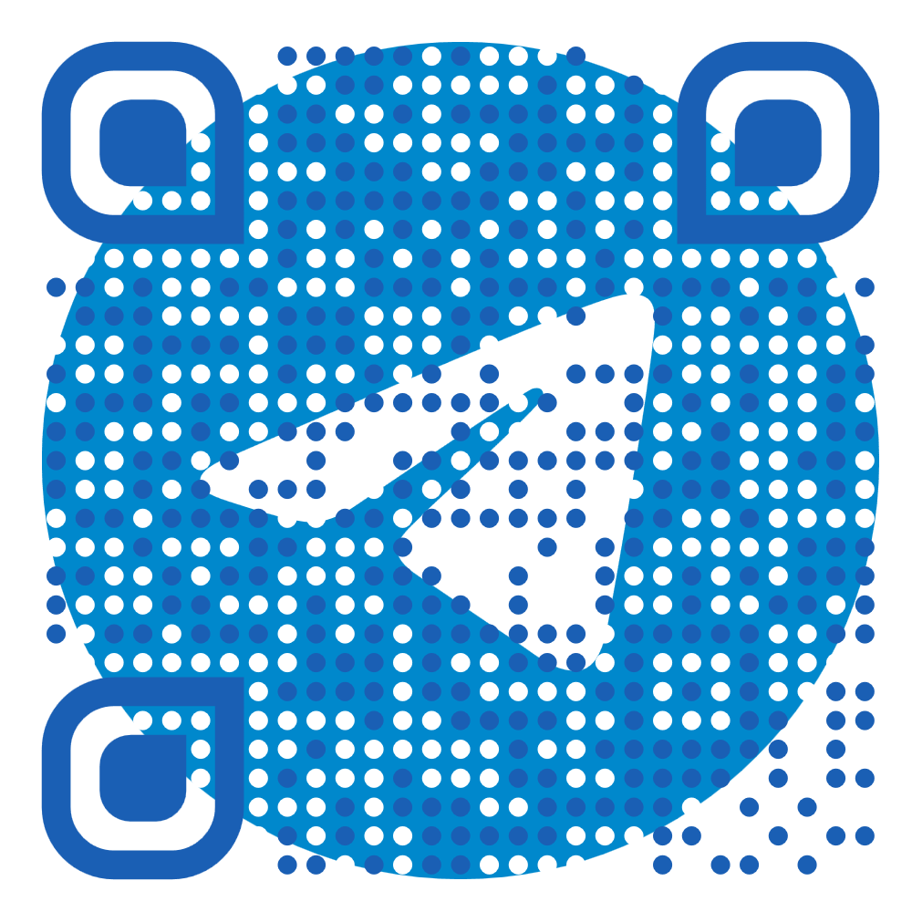
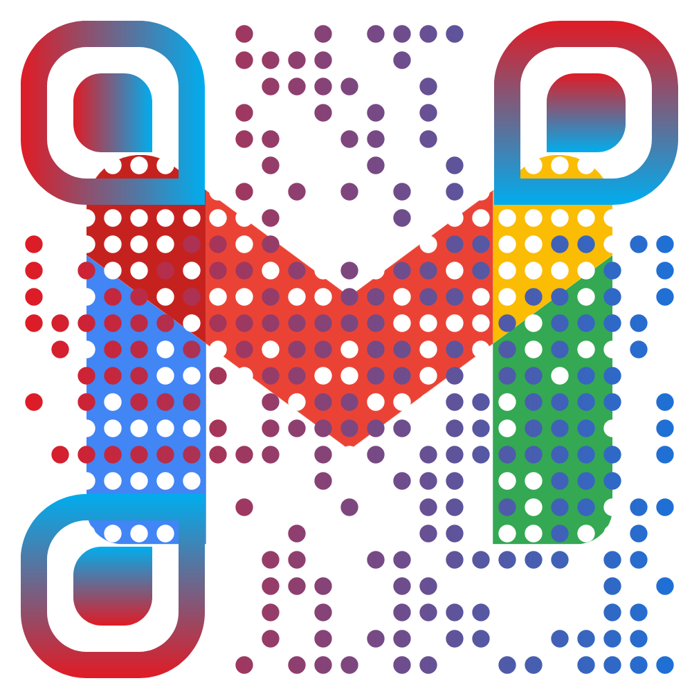

# Hi there, I'm Ali Hassan! 👋

I am a passionate **Full-Stack Student Developer** dedicated to building clean, functional, and user-centric web applications while constantly mastering my craft. 

---

## 🛠️ My Skills & Tech Stack

### 💻 Programming Languages

      

### 🌐 Frontend & UI Design

🧑‍💻 Crafting beautiful, responsive, and interactive user interfaces.

- **Core:**  
- **Framework:** React.js (Vite)
- **Styling & UI Components:** - Tailwind CSS
  - Material UI (MUI)
  - Ant Design

### ⚙️ Backend, Database & Cloud

🛡️ Building robust server-side logic, managing data, and deployment.

- **Runtime:** 
- **Database:** 
- **Cloud & Deployment:**  

---

## 🚀 What I Do

* **MERN Stack Development:** Building full-stack applications from scratch.
* **UI Specialist:** Turning complex designs into pixel-perfect, responsive web layouts.
* **Continuous Learning:** Constantly exploring new tools and optimizing my workflow (currently loving Linux/Debian environments).

---

## 📊 Connect with Me

Scan any of the QR codes below to reach out, collaborate, or just say hi!

| **LinkedIn**                                                       | **Instagram**                                                        | **Telegram**                                                       | **Gmail**                                                    |
|:------------------------------------------------------------------:|:--------------------------------------------------------------------:|:------------------------------------------------------------------:|:------------------------------------------------------------:|
|  |  |  |  |
| [Connect on LinkedIn](https://linkedin.com/in/itx-ali-hassan)      | [Follow on Instagram](https://instagram.com/itx.ali.hassanch)        | [Message on Telegram](https://t.me/ItxAliHassan)                   | [Send Email]([mailto:leotard-mud-scorer@duck.com)            |

---

### ✍️ Dev Quote

